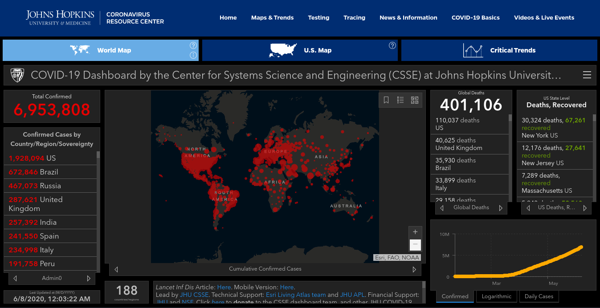
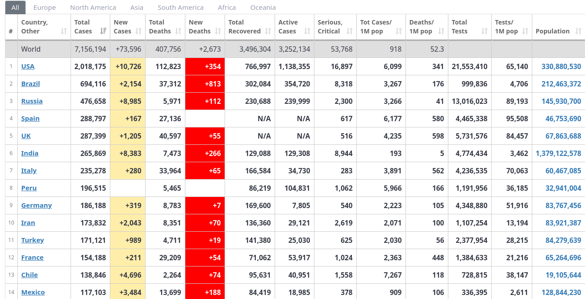

# COVID19
[](https://www.python.org/) [](https://pepy.tech/project/covid) [](https://pypi.python.org/pypi/ansicolortags/) [](https://www.python.org/downloads/release/python-370/)
<hr>


As we can see that COVID19 virus is making such a great impact in this world. Python community has built a <b>covid</b> named library that you can import in your python file and can use that to get real time data for the spreading and advancement in COVID19 stats. This library gives us data prepared by the very prestigious [<b>Johns Hopkins University</b>](https://www.jhu.edu/) and [<b>worldometer.info</b>](https://www.worldometers.info/coronavirus/).


More information can be found [here](https://ahmednafies.github.io/covid/).

## Requirements

```
  python >= 3.6
```

## Installation

```python

pip install covid
```

## Dependencies

```python

pydantic
requests
```

## Usage

# Jhons Hopkins University


 

### Getting all the data

###### Importing
```python
from covid import Covid
```
```python
covid = Covid()
covid.get_data()
```
### Result

```python
[
    {
        'id': '53',
        'country': 'China',
        'confirmed': 81020,
        'active': 9960,
        'deaths': 3217,
        'recovered': 67843,
        'latitude': 30.5928,
        'longitude': 114.3055,
        'last_update': 1584097775000
    },
    {
        'id': '115',
        'country': 'Italy',
        'confirmed': 24747,
        'active': 20603,
        'deaths': 1809,
        'recovered': 2335,
        'latitude': 41.8719,
        'longitude': 12.5674,
        'last_update': 1584318130000
    },
    ...
]
```

 
### Listing Countries

Listing all the countries affected with COVID19 is done by the following :- 

```python
countries = covid.list_countries()
```
#### Result

```python
[ 

  {'id': '18', 'name': 'US'}, 
  {'id': '22', 'name': 'Brazil'}, 
  {'id': '14', 'name': 'Russia'},
  {'id': '17', 'name': 'United Kingdom'}, 
  {'id': '94', 'name': 'India'}
  ...
]
```

### Getting Status by Country Name

You can easily get the status of a country by it's name only, as follows :-

```python
india_cases = covid.get_status_by_country_name('india')
```

#### Result

```python

{
'id': '94', 
'country': 'India',
'confirmed': 265869, 
'active': 129308, 
'deaths': 7473,
'recovered': 129088,
'latitude': 20.593684,
'longitude': 78.96288,
'last_update': 1591641212000
}


```
### Getting Total Active Cases

```python
active = covid.get_total_active_cases()
print(active)
```
#### Result

```python
3479953
```
### Getting Total Confirmed Cases

```python
confirmed = covid.get_total_confirmed_cases()
print(confirmed)
```
### Getting Total Recovered Cases

```python
recovered = covid.get_total_recovered()
print(recovered)
```
### Getting Total Deaths

```python
deaths = covid.get_total_deaths()
print(deaths)
```


# Change of source to worldometers.info



#### Like this

```python
covid = Covid(source="worldometers")
```
### Getting the data from worldometers.info

It is the same way as we did while using the Johns Hopkins API.

```python
covid.get_data()
```

#### Result

```python
[
  { 
    'country': 'USA',
    'confirmed': 1988700,
    'new_cases': 156,
    'deaths': 112101,
    'recovered': 752048,
    'active': 1124551,
    'critical': 17016,
    'new_deaths': 5,
    'total_tests': 20819906,
    'total_tests_per_million': Decimal('0'),
    'total_cases_per_million': Decimal('6010'),
    'total_deaths_per_million': Decimal('339'),
    'population': Decimal('330875237')
    },
 
 {
    'country': 'Brazil',
    'confirmed': 676494,
    'new_cases': 2907,
    'deaths': 36044,
    'recovered': 302084,
    'active': 338366,
    'critical': 8318,
    'new_deaths': 87,
    'total_tests': 999836,
    'total_tests_per_million': Decimal('0'),
    'total_cases_per_million': Decimal('3184'),
    'total_deaths_per_million': Decimal('170'),
    'population': Decimal('212459250')
    },
    ...
]
```


